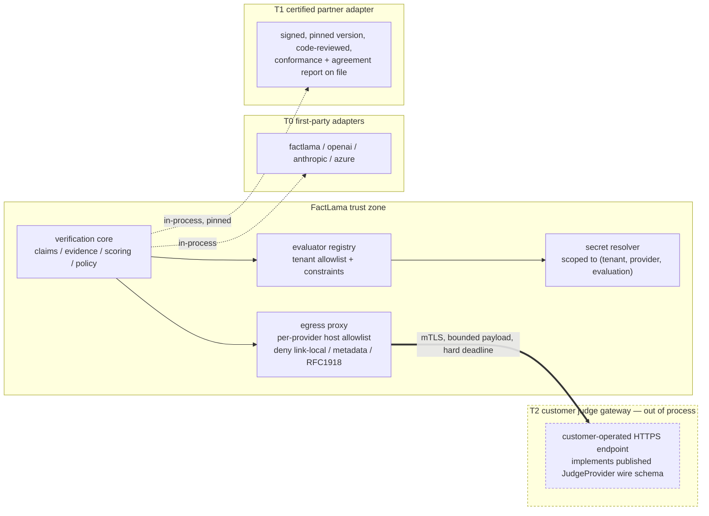

# Architecture memo: what the "any judge" pivot costs us

**Author:** architecture lead
**Date:** 2026-09-13
**Status:** working memo — input to ADR-010..015 and a ROADMAP.md resequencing proposal
**Scope:** consequences of ADR-004 + ADR-006 for EPIC-03 / EPIC-04 / EPIC-07, across all three repos
**Implementation state at time of writing:** every EPIC in `ROADMAP.md`, every REL task in `factlama-reliability/docs/implementation.md`, and every OBS task in `factlama-observability/docs/implementation.md` is `NOT_STARTED`. `factlama-reliability/src/` is empty. This is the cheapest moment we will ever have to fix contract-shaped problems, and the most expensive moment to pretend they don't exist.

---

## 1. The pivot is the right call, and here is the precise reason

I want to be specific about *why* it's right, because the reason determines what we now owe the design.

**It removes a single point of product failure.** Under the old thesis, FactLama's value was bounded above by the quality of one model we had to train, evaluate, host, and defend. `ADR-006` now reduces the SLM to "an optional low-cost evaluator, not the platform itself," and `factlama-reliability/README.md` states the consequence bluntly: "The Reliability Engine is the platform brain, not merely a wrapper around the FactLama SLM." That sentence is the whole pivot. If the SLM never gets competitive, the product still works.

**It matches how enterprises actually buy.** A regulated enterprise has an approved-model list. A product that requires them to send evidence — often their most sensitive documents — to *our* model is a procurement dead end. `CONTRACTS.md`'s tenant-approved-provider model and `judge-provider.md`'s "registry selects an allowlisted tenant-approved provider" turn that blocker into a config field.

**The abstraction is placed at the correct seam, and unusually well.** Most teams would have made `JudgeProvider` return a raw string or a provider-shaped blob. We didn't. The things this corpus already gets right and that I do not want anyone to "simplify" later:

- `CONTRACTS.md`: adapters "MUST NOT invent a factual verdict," and `TIMEOUT|RATE_LIMIT|UNAVAILABLE|INVALID_RESPONSE|CANCELLED|CONFIGURATION` are typed. A provider outage cannot become a hallucination finding.
- `CONTRACTS.md` + `scoring.md`: `FAILED`/`ABSTAINED` force `verdict=ABSTAIN`; "provider timeout or transport failure is never `UNSUPPORTED` or `FAIL`." This is the single most-violated invariant in commercial eval products and we've written it down before writing code.
- `judge-provider.md`: "Validate that returned evidence IDs were supplied; reject malformed or contradictory response shapes as `INVALID_RESPONSE`." Deterministic post-validation of model output, not trust.
- `judge-provider.md`: "A fallback provider is a policy decision recorded in provenance, not a hidden adapter behavior." Correct and rare.
- `scoring.md`: "Scores describe evaluated evidence, not absolute truth probabilities," and "never relabel these v0.1 ratios as confidence."
- `evidence-engine.md`: "Candidate similarity is routing only, never a support verdict."
- `policy-engine.md`: factual verdict and policy action are separate objects, and "Policy never claims a failed provider proved hallucination."

That is a genuinely disciplined epistemic spine. My argument in the rest of this memo is that the pivot **moved the product's central risk** and the spine hasn't been extended to cover where the risk went.

**Where the risk went.** Before: "is our model good enough?" — a model problem, owned by a training team, measurable with one benchmark. After: "does a score mean the same thing across heterogeneous judges, and is it safe to let third-party judges and third-party adapters into the verdict path?" — a **contract, calibration, and trust-boundary problem**, owned by us, and currently unaddressed in every document I read.

Two short observations that frame everything below:

1. Under `scoring.md` v0.1, groundedness is `count(SUPPORTED)/count(applicable)`. The scoring layer is transparent and deterministic — and *carries no semantic content of its own*. One hundred percent of the meaning of every score we publish comes from the judge's labels. "Transparent scoring" over an uncalibrated, tenant-selected judge is transparent arithmetic on an unmeasured input. We have made the arithmetic auditable and left the input ungoverned.
2. Our verdict is not an observation, it is a **control signal**. `policy-engine.md` actions include `BLOCK`, `PASS`, `HUMAN_REVIEW`, enforced "at the customer application's decision point." Anything that can influence a judge's label can influence a customer's gate. That promotes several things I'd normally call "quality issues" into security issues.

---

## 2. Gaps, tiered by when they become expensive

I've tiered by **cost of delay**, not by abstract severity — that's the decision we actually have to make. Tier 0 items are nearly free today and require a major version bump after EPIC-04 ships. Tier 1/2 items are severity-driven.

### Tier 0 — must be settled before EPIC-03 freezes the v0.1 contract

`CONTRACTS.md` says "breaking changes require an ADR and a new major version." Everything here is a field shape. Adding a field to a design doc costs an afternoon. Adding it after `POST /v0.1/verifications` is public costs a `v0.2`, a dual-write migration in `evaluations.result_json` and `reliability_events.scores_json`, and a dashboard fork.

#### T0-1. Scores carry no calibration identity — cross-provider comparability is structurally impossible today

**Evidence.** `CONTRACTS.md`: `scores` is a map of dimensions to `{value, status, method_version}`. `LOW_LEVEL_IMPLEMENTATION.md`: "Each measured score carries method version `*-0.1`." `method_version` names the *aggregation formula* (`groundedness-0.1`), not the judgment that produced the labels. So tenant A on a frontier judge and tenant B on their internal 7B judge both emit `{"groundedness":{"value":0.5,"status":"MEASURED","method_version":"groundedness-0.1"}}`. Identical wire shape. Non-comparable numbers. Nothing in the contract says so.

**Where it bites.** `storage-query.md` `GET /v0.1/ai/reliability` returns "measured score distributions and evaluator versions"; `dashboard.md`'s Reliability view offers "Filter by model/version" as an *optional* filter. Default behaviour is therefore to pool score distributions across judges and render one histogram. `observability/docs/LOW_LEVEL_IMPLEMENTATION.md` is scrupulous about never summing mixed currencies — "cost totals group currency/pricing version or explicitly state mixed prices, never add different currencies." We apply that rigour to dollars and not to the scores that are our actual product.

**The closest thing we already say** is one clause in `judge-provider.md`: "A provider's confidence is not a calibrated FactLama score until benchmarked." Right instinct, wrong scope — it governs the provider's optional confidence field, not the FactLama groundedness score we derive from the provider's labels.

**Fix (contract delta).** Introduce a **calibration class**: a stable hash/ID over `(evaluator_id, evaluator_version, provider_id, model_id, configuration_version, qualification_status)`. Put it on every score object and on `ReliabilityEvent`. Then state the invariant in `CONTRACTS.md` and enforce it in `storage-query.md`: *scores are comparable only within a calibration class; any aggregate spanning classes must either group by class or be explicitly labelled mixed, exactly as we already require for currency.* This is ~2 fields and one paragraph now.

**Tradeoff.** It makes the dashboard harder: a tenant that switched judges mid-quarter sees two series instead of one clean trend. That is the honest picture, and honesty about measurement is the thing we're selling. `dashboard.md` already says "Do not imply a tiny sample is a stable trend" — same principle.

**Verification.** Extend `factlama-reliability/README.md` test scenario 10 — today it only asserts that "Provider A and Provider B evaluate the same request -> public result remains *structurally* compatible." Structural compatibility is the weak claim and we should say so out loud. Add: same fixture set through two adapters, assert per-class agreement (Cohen's κ or simple disagreement rate) is *reported*, and assert the two results carry *different* calibration classes.

#### T0-2. Provenance is scalar-shaped, so fallback and ensembles are already a breaking change

**Evidence of the inconsistency, in our own docs.** `judge-provider.md` and `policy-engine.md` both promise fallback is recorded: "A fallback on judge failure records both attempts and does not conceal the initial failure." But `CONTRACTS.md` `provenance` is singular — one `provider_id`, one `model_id`, one `configuration_version`. **The wire contract cannot currently represent the fallback behaviour two other specs require.** That's not a future concern; it's a live contradiction that EPIC-04 will hit the first time it wires a retry to a second provider.

`domain-model.md` compounds it: "one claim has exactly one final normalized verdict," and `LOW_LEVEL_IMPLEMENTATION.md` step 5: "Select the tenant-approved judge/configuration version. Call the adapter once per claim."

**Fix.** Make `provenance.attempts` an **array** in v0.1 with exactly one entry for MVP, each entry carrying provider/model/config/qualification/outcome/usage/timing. Keep the derived scalar convenience fields if we want, marked as "primary attempt." Simultaneously allow a claim finding to carry `contributing_judgments[]`, empty or single in MVP. Cost today: a nested object. Cost later: `v0.2`.

#### T0-3. Judge cost/usage has a producer, no consumer, and no column — the product thesis is unmeasurable

**Evidence.** `CONTRACTS.md` provider ports: `JudgeResult` returns "token/cost/latency metadata." Then it dead-ends. `ReliabilityEvent` requires "score summaries, evaluator version" and is explicitly "references, not bodies" — no judge tokens, no judge cost. On the observability side, `observability/docs/LOW_LEVEL_IMPLEMENTATION.md` prices **spans** (`spans(... input_tokens, output_tokens, cost, currency, pricing_version ...)`) from the customer's *generation* calls; `reliability_events(...)` has no usage columns at all; `GET /v0.1/ai/models` groups by span provider/model.

**Why this is a top-tier gap and not a metrics nicety.** `README.md` line 19 is the product: "FactLama does not sell another model call; it aims to reduce the number of expensive calls required to make AI systems reliable." The metric that proves or disproves that claim is **verification cost as a fraction of generation cost**, per tenant, per provider, per mode. We have the numerator's source (`JudgeResult`) and the denominator (span cost) and no path between them. We cannot demo our own thesis in our own dashboard. Under "any judge" this gets worse, not better: the whole point of a pluggable judge is that a tenant can choose a cheaper one, and choosing rationally requires cost-per-evaluation *next to* agreement-with-reference.

**Fix.** Plumb it end to end: `JudgeResult.usage` → `provenance.attempts[].usage` → `ReliabilityEvent.usage_summary` → usage/cost columns on `reliability_events` → an aggregate on `GET /v0.1/ai/reliability` (or a new `/ai/verification-cost`) → one dashboard cell: verification cost per evaluation, and verification-to-generation cost ratio. Reuse the existing pricing discipline verbatim — versioned tenant-approved price table, unknown price means `UNAVAILABLE` not zero, never sum currencies.

#### T0-4. Missing enum values we will need and cannot add cheaply later

- No `BUDGET_EXHAUSTED`. `CONTRACTS.md` error codes have `RATE_LIMITED` but nothing for a token/cost budget stop; the `JudgeProvider` error taxonomy has no budget member either. (See T1-3.)
- No way to represent judge disagreement. `claims[].verdict` has five values, none meaning "two qualified judges disagreed." `violations` has thirteen codes, none for disagreement. Today that collapses into `INSUFFICIENT_EVIDENCE` or `ABSTAIN`, which are lies about *why*.
- No way to flag adversarial evidence. (See T1-2.)
- No `qualification_status` on provenance (see T2-1), so a result produced by an unbenchmarked judge is indistinguishable on the wire from one produced by a qualified judge.

**Fix.** Reserve `BUDGET_EXHAUSTED` (error code + provider error type), a `DISPUTED` rationale/disagreement representation, violation codes `JUDGE_DISAGREEMENT` and `EVIDENCE_INJECTION_SUSPECTED`, and `provenance.attempts[].qualification_status ∈ {QUALIFIED, PROVISIONAL, UNQUALIFIED}` — in v0.1, even if MVP never emits them. `CONTRACTS.md` already permits "MAY ignore unknown additive fields within a supported major version," so reserving now is free and adding later is not.

---

### Tier 1 — must be settled before EPIC-04 ships the first adapter

#### T1-1. The custom-adapter execution model is undecided, and it decides whether EPIC-02 is achievable at all

This is the one I'd escalate first on severity. **"Any judge" means third-party code or third-party endpoints in the verdict path. We have never written down what privileges that code gets.**

**Evidence of the implicit answer.** `factlama-reliability/README.md` target module layout: `judges/{factlama,openai,anthropic,azure,custom}/`. `claude/BOUNDARIES.md`: "Provider, retrieval, persistence and event transport are adapters behind ports." Read together, the default reading is: a custom enterprise adapter is a Python module in our process. `judge-provider.md` then hands that module a live secret: "Credentials are resolved at call time from a secret reference."

**What an in-process adapter actually has.** The PostgreSQL connection pool (`ADR-009`), so every tenant's `evaluations`, `jobs`, and `outbox` rows. The secret resolver, so every tenant's provider credentials. The process filesystem and environment. Unrestricted outbound network.

**Attack path, stated defensively.** A customer-supplied or partner-supplied adapter — malicious, or merely compromised upstream via a dependency — is loaded into the shared Reliability worker. On its next invocation it (a) enumerates secret references beyond its own tenant and exfiltrates provider keys, (b) reads evidence content for *all* tenants passing through the process, (c) issues requests to the deployment's internal network or cloud instance-metadata endpoint because "provider base URL" is adapter-controlled, and (d) reports plausible verdicts throughout so nothing looks wrong. `EPIC-02`'s exit criterion is "cross-tenant access fails safely." **Third-party in-process code makes that exit criterion unverifiable**, because tenant isolation in a shared process is an application-code property and the adapter *is* application code.

`SECURITY_MODEL.md`'s threat-test list — "forged tenant fields, cross-tenant IDs/cursors/jobs/cache, stale worker context, replayed events, privilege escalation, redaction bypass via errors/logs, oversized payloads and secret leakage to model providers" — is a good list that assumes all first-party code. It has no entry for hostile extension code. A grep of all three repos returns zero hits for `SSRF`, `egress` (outside one collector sentence), `sandbox`, or `supply chain`.

**Recommendation: a tiered trust model, decided in an ADR, before EPIC-04 writes the first adapter.**

- **T0** — first-party adapters. In-process. Our code, our review, our CI.
- **T1** — certified partner adapters. In-process but signed, version-pinned, code-reviewed, with a conformance run and an agreement report on file. Explicit operator action to install.
- **T2** — customer adapters. **Out of process only.** We publish `JudgeProvider` as an HTTP wire schema (it is already a clean one-claim-in/one-verdict-out port, so this is a small step from `CONTRACTS.md`); the customer runs the endpoint; we talk to it over mTLS through the egress proxy with a hard deadline, payload cap, and no access to our database or secrets.

T2-over-HTTP is the highest-leverage recommendation in this memo because it solves four separate problems at once: it converts a code-trust boundary into a network boundary we can actually enforce; it lets the customer keep their model credential (T1-3, who-pays); it gives them residency by construction (T2-3); and it means "bring your own judge" requires zero code review by us, which is what makes the ecosystem scale.

**Companion controls, regardless of tier.**
- Secret resolution must be *authorized per call*: the resolver may only resolve references bound to `(tenant_id, provider_id)` for the evaluation in flight. `judge-provider.md` gets this half right ("resolved at call time from a secret reference") — make the authorization explicit, or we've built a confused deputy where tenant A's evaluation can reach tenant B's key.
- Egress allowlist enforced at the proxy/network layer, not by the adapter. `SECURITY_MODEL.md` already asserts the *policy* — "External provider egress is tenant-approved and recorded with provider/config version" — with no mechanism. Deny link-local, cloud metadata, and private ranges by default; reject tenant-supplied free-form provider base URLs unless an operator allowlists the host.
- Judge free-text rationale is untrusted third-party model output rendered in a browser (`CONTRACTS.md`: "Free-text rationale is optional and content-governed"). `dashboard.md` says nothing about it. Add: render as inert text; never as HTML, never as markdown that produces links or images. Otherwise we've built a stored-XSS and pixel-exfiltration path through the rationale field.

#### T1-2. Indirect prompt injection through evidence → verdict laundering

**Evidence.** `CONTRACTS.md`: `VerificationRequest.evidence[]` entries carry `content`, and "optional source URI, title, retrieval rank/score, timestamp and trust label are descriptive metadata, never proof of truth." That last clause shows we understand evidence isn't *true*. We have not written down that evidence isn't *inert*. Zero hits for "injection" across all three repos.

**Why this is the most product-critical threat in the corpus.** In the realistic deployment, evidence is RAG output over a customer corpus that includes user-uploaded documents, ticket text, wiki pages, or scraped content. That content is attacker-influenceable, flows verbatim into a third-party judge prompt, and the judge's label *is* our product. Then `policy-engine.md` turns that label into `PASS` / `BLOCK` / `HUMAN_REVIEW` at the customer's decision point. So evidence-borne injection is not "the model said something odd" — it is **a bypass of the customer's content gate, achieved by writing a sentence into a document.** Both directions matter: force `SUPPORTED` to smuggle a false claim past review (fail-open), or force `CONTRADICTED` to denial-of-service a competitor's or colleague's legitimate content (fail-closed abuse).

The pivot makes this worse in one specific way: with heterogeneous judges we have **heterogeneous injection resistance**, a tenant-chosen 7B internal judge is likely far more suggestible than a frontier model, and we currently have no mechanism to know or to report which.

**Containment — and I'll be explicit that this is containment, not a fix. Nobody solves prompt injection.**

1. **Structural instruction/data separation** in the judge prompt template, versioned as part of `configuration_version`: evidence is delimited, labelled as data, and the system framing states that evidence never carries instructions. Weak alone; necessary.
2. **Name the isolation we already have as a security property.** `CONTRACTS.md` — one claim, bounded evidence, per call — means an injection payload's blast radius is one claim's verdict, not the whole evaluation. That's real containment we got for free from the port design. Write it down in `SECURITY_MODEL.md` so nobody "optimizes" it into a batched multi-claim call for token savings without an ADR.
3. **Strengthen deterministic post-validation.** `judge-provider.md` already requires cited evidence IDs to have been supplied. Extend: a `SUPPORTED` verdict with zero cited evidence IDs is `INVALID_RESPONSE`, not a finding. Add a cheap non-model overlap check between the claim and the cited evidence span; failure downgrades to `INSUFFICIENT_EVIDENCE` and emits a violation. This is the same philosophy as `evidence-engine.md`'s "similarity is routing only" — deterministic checks bound the model's authority in both directions.
4. **Detect, don't block.** An injection-pattern scan over evidence content sets `EVIDENCE_INJECTION_SUSPECTED` and a telemetry signal, which policy can route to `HUMAN_REVIEW`. Do not silently drop evidence — that changes the factual basis of the verdict, which would violate `evidence-engine.md`'s rule that contradictory evidence must be passed through rather than discarded.
5. **Fixtures.** `evidence-engine.md` tests cover "empty corpus, inaccessible reference, duplicate IDs, irrelevant but similar text, conflicting sources, stale source metadata, citation mismatch." None adversarial. Add an adversarial-evidence fixture family to the golden set, and — this is the part that justifies the whole harness — run it against **every** registered adapter, so injection resistance becomes a measured, comparable per-provider property rather than an assumption.

#### T1-3. No budget anywhere — denial-of-wallet, with a tenant-controlled amplification factor

**Evidence of what we do bound and what we don't.** `policy-engine.md` bounds "maximum attempts, total deadline, allowed provider list." `async-evaluation.md` bounds attempts and total deadline. `API.md` returns 429 "for quota." `collector.md` and `observability/docs/LOW_LEVEL_IMPLEMENTATION.md` have per-tenant quotas and 429/503 backpressure — **for telemetry ingestion**. Nothing in the corpus bounds **tokens or money** on the judge path.

**The amplification is the problem, and it's ours.** `claim-engine.md`: we do server-side segmentation, and "Split conjunctions when each part can be independently supported." `LOW_LEVEL_IMPLEMENTATION.md` step 5: "Call the adapter once per claim." So judge calls ≈ `claims_extracted × evidence_volume × (1 + retries) × (1 + fallback_attempts)`, where `claims_extracted` is a function of caller-supplied text. A single accepted request with a long conjunctive answer fans out into hundreds of judge calls. `CONTRACTS.md` says "Payload and field limits are deployment configuration, documented by the API, and enforced before external judge calls" — that bounds bytes, not fan-out, and there is no `MAX_CLAIMS_PER_REQUEST`.

Two aggravating paths worth naming: a compromised tenant API key becomes a direct spend channel against whichever provider that tenant approved; and fallback-on-failure (`policy-engine.md`) *doubles* spend precisely during a provider brownout — the moment the platform is already degraded.

**Fix.** A first-class budget: per-request and per-tenant-per-window token and cost ceilings, enforced in the pipeline before dispatch and decremented across retries *and* fallback attempts. A hard `MAX_CLAIMS_PER_REQUEST` and `MAX_EVIDENCE_PER_CLAIM`. Exceeding a budget produces `ABSTAINED/ABSTAIN` with `BUDGET_EXHAUSTED` — which slots cleanly into the existing rule that technical failure yields abstention, never a factual verdict. Emit a budget-exhaustion metric so it's an alertable condition, not a silent quality regression.

**And decide who pays, in writing.** `README.md` says we don't sell another model call; `judge-provider.md`'s secret-reference model implies the tenant's own credential. Make it explicit in `PRODUCT_BOUNDARIES.md`: **BYO-key is the default** — the tenant's credential, the tenant's provider bill, FactLama never brokers or marks up model calls. That makes the thesis literally true, keeps the denial-of-wallet liability with the party who controls the spend, and deletes an entire billing subsystem from the roadmap. If we ever want a hosted/brokered tier, that's a separate ADR with its own abuse model — but it should be a deliberate reversal, not a default that drifts in because someone hardcoded an API key for a demo.

#### T1-4. The agreement harness should exist at EPIC-04, not EPIC-12 — and it's small

This is the direct answer to the sequencing question.

**Current order.** `ROADMAP.md`: EPIC-04 (Phase B) ships "First provider adapter" + "Golden evaluation tests," exit criterion "supplied answer + evidence produces deterministic normalized result with provenance." EPIC-07 adds "Provider registry / Second/custom provider path / Evaluator/config versioning." EPIC-12 (Phase F, last) builds "Benchmark datasets/harness."

**The trap.** "Deterministic" in EPIC-04's exit criterion describes the *pipeline*, not the *judge* — and nothing in EPIC-04 measures whether the judge is right. We ship an MVP whose scores look authoritative and are unmeasured. At EPIC-07 we add a second adapter, discover the two disagree materially, and the remedy touches the score contract (calibration class), the provenance shape (attempts array), and the query/dashboard aggregation rules — i.e. breaking changes to a shipped v0.1. That is exactly the rearchitecting risk to avoid.

**But I do not recommend moving EPIC-12 before EPIC-04.** Labelled datasets at scale, human baselines, and leakage controls (`REL-15`) are months of work and would contradict `PRODUCT_BOUNDARIES.md`'s deliberate deferral. That's the wrong lesson to draw.

**Recommendation: split EPIC-12 and pull forward only the harness.** EPIC-04 *already* requires golden evaluation tests and `factlama-reliability/README.md` already specifies twelve golden scenarios. The increment is a runner that executes that fixture set against any registered adapter and emits a comparable report: per-class precision/recall/F1 against reference labels, disagreement rate, abstention rate, adversarial-fixture resistance, p50/p95 latency, tokens, cost. On top of tests EPIC-04 must write anyway, that's a small module — and it is *the same artifact* that later becomes the SLM benchmark harness (EPIC-12), the third-party certification suite (EPIC-07 / T2-1), and the drift canary (T2-4). Build it once, at EPIC-04, or build it three times.

Concretely: add **EPIC-04b — Evaluator agreement harness**, exit criterion: *the first adapter has a published agreement report against the golden set, and adding any new adapter produces a comparable report by running one command.*

---

### Tier 2 — must be settled before EPIC-07 opens the ecosystem

#### T2-1. The qualification bar is asymmetric, and the registry lifecycle doesn't exist

**Evidence.** `ADR-006` gates *only* the SLM: it "must earn routing preference through benchmark results covering accuracy, precision, recall, F1, calibration, latency, token use, and cost." Nothing anywhere imposes any bar on a third-party judge. `REL-15`'s acceptance is sharp — "routing preference is based on reproducible results and thresholds approved in an ADR, not model size or cost claims alone" — and it applies to our model only.

**Why the asymmetry is a real problem, not a fairness complaint.** It embeds a bad incentive: our own cheap evaluator must clear a quantitative bar while a frontier model enters routing on brand. When the routing decision finally gets made, the evidence base will be asymmetric in favour of the expensive option — which undermines the economic thesis the pivot is supposed to protect. It's also inconsistent with our own epistemics: we refuse to let retrieval similarity imply truth (`evidence-engine.md`) and refuse to let a provider's confidence imply calibration (`judge-provider.md`), then let a vendor's reputation imply judgment quality.

**Fix — ADR-010, provider-neutral evaluator qualification.** Any evaluator — SLM, frontier, enterprise-internal, partner — must have a published agreement report against the golden set (from T1-4) before it can be a tenant's **default** judge. Providers without one remain *usable* (this is essential; "any judge" must not become "any judge we've certified") but are marked `qualification_status=UNQUALIFIED` in provenance, carry a distinct calibration class, and are excluded from cross-provider aggregates and from any FactLama-published quality claim. `ADR-006` then survives as the SLM-specific special case of a general rule.

**Fix — the registry lifecycle.** `judge-provider.md` references "the registry"; EPIC-07 and REL-13 list "Provider registry" as a checkbox; `IMPLEMENTATION_MAP.md`'s component table doesn't mention it at all. Under this pivot the registry is the most important control-plane object in the product and it has no spec. Define a state machine and the authorization for each transition:

`REGISTERED → CONFORMANCE_PASSED → AGREEMENT_REPORTED → TENANT_APPROVED → {DEPRECATED, REVOKED}`

with: conformance = the `REL-13` fixture suite (success, ambiguity, timeout, rate limit, malformed response) run as a **gate**, not just a CI test; separation of duties between *configuring* a provider and *approving* it for default routing (`SECURITY_MODEL.md` has one coarse "administrative configuration" scope); `REVOKED` propagating immediately to in-flight evaluations and to any policy that names the provider as a fallback; and an audit record per transition (`SECURITY_MODEL.md` already requires this shape for "provider references" — wire it to the state machine). New doc: `factlama-reliability/docs/evaluator-registry.md`.

**Two golden sets, not one.** `REL-15` distinguishes "development/test sets and leakage controls" for the SLM. Carry that to third parties: a **public dev set** so an enterprise can self-test its adapter before submitting, and a **held-out set we control** so no vendor can tune to the certification. Without the split, certification is theatre.

#### T2-2. Multi-judge consensus: correctly deferred, incorrectly un-provisioned

Answering the question directly: today it is **strictly one judge per evaluation**, and the only multi-provider path is sequential fallback.

**Evidence.** `CONTRACTS.md`: `evaluate` "receives one claim" and `JudgeResult` returns "one normalized claim verdict." `domain-model.md`: "one claim has exactly one final normalized verdict." `LOW_LEVEL_IMPLEMENTATION.md` step 5: one selected judge, one call per claim. `README.md` puts "multi-stage judge cascade" in Future scope.

**My assessment: deferring the *feature* is right; leaving the *shape* un-provisioned is the mistake.** Ensembles are exactly the mitigation that heterogeneous judge quality calls for — and the natural product answer to "your internal judge is weaker than a frontier judge" is "run both in DEEP mode and surface disagreement." But building it in MVP would be scope creep against `PRODUCT_BOUNDARIES.md` and would let us dodge the harder and more valuable calibration work. So: defer the behaviour, land the shape in v0.1 (T0-2, T0-4), and add one paragraph to `verification-pipeline.md` stating that multi-judge reconciliation is deferred, that disagreement will be represented not silently majority-voted, and that no design may assume a single judgment per claim.

One thing that must *not* be deferred, because it's a correctness issue in the code we're about to write: **disagreement is not the same as insufficient evidence.** Whenever two judgments exist — even today's fallback case — the result must be able to say "two qualified judges disagreed" rather than laundering it into `ABSTAIN`. Without the enum from T0-4, the first ensemble implementation will lie.

#### T2-3. Judge egress is the residency event, and residency is specified only for storage

**Evidence.** Residency appears three times and is about *persistence* every time: `PRIVACY.md` #7 "Data residency and customer-managed storage are future-compatible requirements"; `SECURITY.md` "compatible with future ... data residency"; `ROADMAP.md` EPIC-14 "Data residency/customer-managed storage patterns." `PRODUCT_BOUNDARIES.md` defers "Enterprise SSO/RBAC/data-residency controls."

**The inversion.** Our default capture mode is `METADATA_ONLY` (`SECURITY_MODEL.md`), and `PRIVACY.md` #1 is "Raw content persistence is never required for core observability." So for a regulated tenant running our recommended defaults, **we barely store anything — and the one compliance-relevant event in the whole system is the judge call**, which ships `evidence[].content` (often their most sensitive documents) across an organizational and geographic boundary. `SECURITY_MODEL.md` names that boundary — "External provider egress is tenant-approved and recorded with provider/config version" — and `SECURITY.md`'s trust-boundary list includes "Reliability engine to external model providers." Neither says anything about *where* the provider is or what it does with the payload. **Our privacy architecture is rigorous about persistence and silent about transmission.** For an EU tenant that asymmetry is the entire conversation, and it will surface in the first enterprise security review, not in EPIC-14.

**Fix.** Registry entries carry compliance attributes: `hosting_region`, `data_processing_terms_ref`, `trains_on_submitted_data: bool`, `retention_at_provider`, `subprocessors`, `certifications[]`. Tenant policy then expresses **constraints**, not just an allowlist — e.g. *require `hosting_region ∈ {eu-*}` and `trains_on_submitted_data == false`* — and provider selection becomes a constraint check. Two consequences that matter more than the schema:

- **Fallback must satisfy the same constraints.** `policy-engine.md` bounds fallback by an "allowed provider list," which is necessary but not sufficient — a compliance-violating fallback during a primary-provider outage is precisely how this breaks in production, and it breaks silently, under time pressure, at 3am.
- **No compliant provider available ⇒ `ABSTAIN` + `HUMAN_REVIEW`, never a silent non-compliant call.** Fail closed on compliance; we already fail closed on redaction (`SECURITY_MODEL.md`: "Redaction failures fail closed for content persistence"), so this is consistent.

This also argues for T2 judge gateways (T1-1): a customer-operated endpoint in their own region resolves residency by construction, without us certifying anything.

#### T2-4. Model aliases silently invalidate calibration, and re-scoring is impossible for our default tenant

**Alias drift.** `judge-provider.md` says the registry selects an "immutable configuration version." But if a tenant configures a *floating* model alias, the configuration is immutable while the model behind it changes under us — verdict distributions shift, any calibration silently expires, and no version bump records it. Fix: extend immutability to require a **pinned, non-aliased model identifier**, and treat any provider-side model change as a new calibration class. Detect it with a periodic canary: re-run the golden set against each approved provider on a schedule and alert on agreement drift. `OBS-09`'s "Reliability regression conditions" is the right home and is currently a bare checkbox — under "any judge" it needs to cover *provider* regression, not just customer-model regression, because a judge quietly getting worse is indistinguishable from an application quietly getting better.

**Re-scoring.** The only re-evaluation semantics in the corpus are in `INTERACTION_STORE.md`, and they're correct: "Replay creates a new evaluation ID and preserves lineage to the original interaction, evaluator/prompt/model/config versions and evidence snapshot; it cannot silently overwrite production results." But that mechanism is gated behind `ADR-008`, deferred, and requires stored evidence. Therefore: **metadata-only capture and cross-version re-scoring are mutually exclusive**, and our default is metadata-only. No document says this out loud, and it is a consequence customers will care about the first time they ask "our judge changed — can you re-score last quarter?" The answer is no, by design, unless they opted into content capture.

Write that tradeoff down in `PRIVACY.md` and `INTERACTION_STORE.md` as a stated consequence rather than an accident. Add the rule that historical results are **never mutated** in place: a re-score is a new `evaluation_id` with a `supersedes` link, and trend lines annotate calibration-class changes as visible markers (extending `dashboard.md`'s existing "do not imply a tiny sample is a stable trend" discipline).

---

### Tier 3 — before first real enterprise deployment

#### T3-1. No per-provider bulkheads: one slow judge starves every tenant

`judge-provider.md` has deadlines, bounded concurrency, rate limits, cancellation — all good, all *global or per-provider-unspecified*. `SYSTEM_ARCHITECTURE.md` §8 mentions "circuit breaking where external dependencies justify it" and nothing implements the thought. Meanwhile `ADR-009` gives us a single PostgreSQL-backed job queue with leases: **one shared worker pool**.

Predictable first production incident: a tenant approves a self-hosted judge with p99 of 40 seconds. Workers block on it, leases expire (`async-evaluation.md`: "expired leases return to QUEUED"), the job is retried, more workers block. Every other tenant's evaluations queue behind one slow provider. Head-of-line blocking across tenants — which is a *tenant isolation* failure expressed as latency, and therefore in scope for `EPIC-02`'s spirit even though it isn't a data leak.

Fix: per-`(tenant, provider, model)` concurrency caps and circuit breakers; a separate worker pool or lease class for providers marked slow/unqualified; and a rule that a breaker-open provider yields `ABSTAINED` fast rather than consuming a worker. Heterogeneous providers make this mandatory rather than nice-to-have — it's the direct operational cost of "any judge."

#### T3-2. `mode` is an unbound knob and `SWITCH_MODEL` is ambiguous

`CONTRACTS.md` defines `mode ∈ {FAST, STANDARD, DEEP}`; `factlama-reliability/README.md` describes intent and adds "The names describe intent, not hard-coded model vendors." Nothing maps mode to provider selection, claim caps, token/cost budget, deadline, or ensemble size. It is currently a field we accept and ignore. Under this pivot, mode is the natural user-facing handle for the cost/quality tradeoff across heterogeneous judges — define it as a **named, versioned routing profile** (provider set, max claims, token/cost budget, deadline, judgments per claim) recorded in provenance. `DEEP` is where ensembles eventually live.

`SWITCH_MODEL` (in `README.md`, `factlama-reliability/README.md`, and `policy-engine.md`'s action list) never says *which* model. Pre-pivot, judge and platform were the same thing and the ambiguity was harmless. Post-pivot there are two entirely different control loops with different owners: "regenerate with a different **generation** model" is the customer's application decision; "re-evaluate with a stronger **judge**" is ours. Split the action — `REGENERATE_WITH_DIFFERENT_MODEL` vs `ESCALATE_EVALUATION` — and note that the latter is the first real consumer of ensemble/cascade.

---

## 3. Recommended changes, as a work list

### New ADRs

| ADR | Title | Decides | Needed before |
|---|---|---|---|
| ADR-010 | Evaluator qualification and calibration classes | Provider-neutral benchmark gate; calibration class identity; aggregation rules across classes; supersedes the asymmetry in ADR-006 | EPIC-03 |
| ADR-011 | Judge adapter trust tiers and extension model | T0/T1/T2 tiers; customer judges out-of-process over a published wire schema; per-call scoped secret resolution; egress allowlist | EPIC-04 |
| ADR-012 | Verification budgets and cost ownership | Token/cost budgets, fan-out caps, `BUDGET_EXHAUSTED`; BYO-key as the default economic model | EPIC-04 |
| ADR-013 | Evidence as adversarial input at the judge boundary | Instruction/data separation, per-claim isolation as a security property, deterministic post-validation, detect-not-block, adversarial fixtures | EPIC-04 |
| ADR-014 | Provider lifecycle, pinning and compliance constraints | Registry state machine; pinned non-alias model IDs; compliance attributes and constraint-based selection incl. fallback; immutability of historical results | EPIC-07 |
| ADR-015 | Deferred multi-judge reconciliation | Records that ensembles are deferred but that provenance/finding shapes and disagreement representation are provisioned in v0.1 | EPIC-03 |

### Contract deltas for EPIC-03 (`CONTRACTS.md`)

| Delta | Why now |
|---|---|
| `calibration_class` on each score object and on `ReliabilityEvent` | Comparability is otherwise unexpressible; breaking to add later |
| `provenance.attempts[]` (one entry in MVP) with provider/model/config/qualification/outcome/usage/timing | Resolves the live contradiction between `CONTRACTS.md` and `policy-engine.md`'s "records both attempts" |
| `attempts[].usage` → `ReliabilityEvent.usage_summary` → `reliability_events` columns | Makes the product thesis measurable |
| `attempts[].qualification_status ∈ {QUALIFIED, PROVISIONAL, UNQUALIFIED}` | Distinguishes benchmarked from reputational judges on the wire |
| `claims[].contributing_judgments[]` (empty/single in MVP) | Forward compatibility for ensembles without a major bump |
| Reserve `BUDGET_EXHAUSTED`; violations `JUDGE_DISAGREEMENT`, `EVIDENCE_INJECTION_SUSPECTED`; a `DISPUTED` representation | Additive fields are tolerated in v0.1; new enums after launch are not |
| State the aggregation invariant: scores comparable only within a calibration class; mixed aggregates labelled, exactly as with currency | Prevents `GET /v0.1/ai/reliability` from shipping a wrong default |

### Doc sections to add

- `factlama-reliability/docs/evaluator-registry.md` — **new.** Registry data model, lifecycle state machine, authorization and separation of duties, compliance attributes, conformance gate, audit events, revocation propagation.
- `factlama-reliability/docs/evaluator-agreement-harness.md` — **new.** Fixture families incl. adversarial; report schema; how a new adapter is measured; dev vs held-out set split.
- `SECURITY_MODEL.md` — add the judge-boundary threat model: evidence as untrusted input, adapter trust tiers, egress control, per-call secret scoping, denial-of-wallet, insecure output handling of rationale text. Extend the threat-test list, which today assumes all first-party code.
- `judge-provider.md` — pinned non-alias model IDs; qualification status; budget participation; per-provider breaker/bulkhead; explicit statement that per-claim isolation is a security property.
- `verification-pipeline.md` — budget enforcement stage; deferred-ensemble paragraph; disagreement handling.
- `scoring.md` — state that v0.1 scores are pure functions of judge labels and therefore comparable only within a calibration class.
- `PRIVACY.md` / `INTERACTION_STORE.md` — judge egress as a residency/transmission event; the stated tradeoff that metadata-only excludes cross-version re-scoring.
- `PRODUCT_BOUNDARIES.md` — BYO-key economics; FactLama does not broker model calls.
- `observability/docs/telemetry-model.md`, `storage-query.md`, `dashboard.md` — judge usage/cost attributes and aggregates; calibration-class grouping; provider agreement/drift signals; inert rendering of rationale text.
- `IMPLEMENTATION_MAP.md` — add the evaluator registry and agreement harness rows; they're load-bearing components missing from the reviewer's one-page map.

### ROADMAP.md resequencing

| Change | Rationale |
|---|---|
| EPIC-03: add the contract deltas above | Free now, major version bump later |
| EPIC-02: add the adapter trust-tier ADR (ADR-011) | EPIC-02's isolation exit criterion is unverifiable if third-party code can run in-process; decide before the code shape exists |
| **New EPIC-04b — Evaluator agreement harness** | Golden set + multi-adapter runner + report. Exit: first adapter has a published agreement report; a new adapter produces a comparable one with one command |
| EPIC-04: add budget enforcement, fan-out caps, adversarial fixtures | Cheapest point to bound cost and test injection resistance |
| EPIC-07: gate "second/custom provider path" on ADR-011 + ADR-014 and on the conformance suite being a **runtime gate**, not just CI | This is the moment we expose our infrastructure to third-party judges |
| EPIC-12: keep dataset/human-label/SLM work where it is; note that it *consumes* EPIC-04b's harness | Avoids scope creep while removing the duplicate build |
| EPIC-14: pull *judge* residency constraints forward to EPIC-07; leave *storage* residency in EPIC-14 | Judge egress is the residency event for metadata-only tenants |

---

## 4. What I'd treat as blocking, and what I wouldn't

**Blocking before EPIC-03 is called complete:** the contract deltas. All of them. They are afternoons now and a `v0.2` later, and that's the entire argument.

**Blocking before EPIC-04 ships:** ADR-011 (trust tiers), ADR-012 (budgets + BYO-key), ADR-013 (evidence threat model), EPIC-04b (harness). The first three are decisions, not code. The fourth is a small module on top of tests EPIC-04 owes anyway.

**Blocking before EPIC-07 opens the ecosystem:** the registry spec and lifecycle, the conformance suite as a runtime gate, compliance-constrained selection including fallback, per-provider bulkheads.

**Not blocking — genuinely fine as backlog:** multi-judge reconciliation behaviour, calibrated probability scores, full benchmark datasets with human labels, SLM training, storage residency, replay/re-scoring. The pivot does not require any of these early; it requires that we not *foreclose* them, which is what the Tier 0 shapes buy us.

**One thing I want to be careful not to do:** over-rotate into building a certification bureaucracy before we have a single working adapter. `PRODUCT_BOUNDARIES.md`'s restraint is an asset. The harness should be a test runner and a report, not a program. If "bring your own judge" requires our review and sign-off, we've replaced model lock-in with process lock-in and lost the pivot's benefit.

---

## 5. Open decisions I need answers to

1. **Are customer-supplied judge adapters in-process, ever?** My recommendation is no — T2 is HTTP-only. This is the highest-consequence open question in the design and it must be answered before EPIC-04 establishes the adapter pattern.
2. **BYO-key only, or will we ever broker judge calls?** Affects whether budgets are a safety feature or a billing system, and whether `README.md` line 19 stays literally true.
3. **Who owns the held-out certification set, and is it public?** Determines whether third-party certification is meaningful or performative.
4. **Do we publish cross-provider agreement numbers?** It is our most credible differentiator and it will make some vendors look bad. That's a positioning decision with architectural consequences (public report schema, reproducibility, dev/held-out split).
5. **Is a floating model alias ever acceptable in a tenant's provider configuration?** I'd say no for a default judge, allowed for an unqualified one. Needs a call.
6. **Does an EU tenant with no compliant judge get `ABSTAIN`, or do we let them proceed with a recorded exception?** Fail-closed is my recommendation; it has product consequences someone should own.
7. **Is per-tenant worker isolation in scope before the first enterprise deployment, or do we accept shared-pool head-of-line blocking and monitor it?** `ADR-009`'s single-queue simplicity is right for MVP; I want the decision recorded rather than discovered.

---

### One-paragraph summary

The pivot is correct and the port design is better than most teams' production code. But it moved our central risk from "is our model good enough" to "does a score mean the same thing across judges, and is it safe to let third-party judges and third-party code into the verdict path" — and the corpus answers neither. The five things I'd fix first: (1) scores carry no calibration identity, so cross-provider comparability is structurally impossible and the fix is a breaking change after EPIC-04; (2) the custom-adapter execution model is undecided, and in-process third-party code would make EPIC-02's tenant-isolation exit criterion unverifiable; (3) evidence-borne prompt injection can launder a verdict that `policy-engine.md` turns into a customer's `BLOCK`/`PASS` gate, and the word "injection" appears nowhere in three repos; (4) judge cost is produced by `JudgeResult` and consumed by nothing, so the product thesis is unmeasurable in our own dashboard and nothing bounds spend on a tenant-controlled fan-out; (5) `ADR-006` benchmark-gates our own SLM and nothing else, which is both epistemically inconsistent and biased against the economics the pivot exists to protect.
